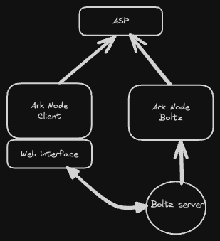

# Boltz x Ark

## Architecture



Boltz runs an Ark node to manage the ark funds. The Boltz API use the Ark node to fund, claim and list VHTLCs.

#### Setup boltz mock

start the ASP, fund it with some liquidity. 

start the user ark-node:
  
```bash
make run
```

reach http://localhost:7000/app to create and fund the wallet.

start the boltz ark-node:

```bash
make run-bob
```

reach http://localhost:7001/app to create and fund the wallet.

start the mock boltz API
  
```bash
make serve-boltz-mock
```

build the swap CLI

```bash
make build-swap-client
```

run the swap CLI

```bash
./build/boltz-swap-client swap --amount 10000
```

```bash
./build/boltz-swap-client reverse-swap --amount 10000
```